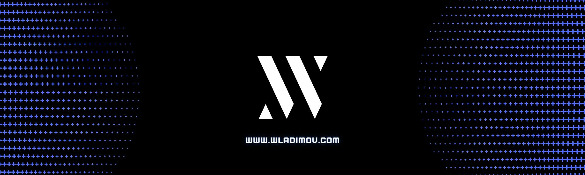

# 👋🏻 &nbsp;&nbsp;Hi there, I am Wladimir Moya @wladimov

<!-- 
Hi, I'm Wladimir Moya, a self-taught passionate FrontEnd developer from Ecuador.I've been building stuff on the web since when 2018. I enjoy writing post in my blog about the things that I am learning.
 -->

Hi, I'm Wladimir Moya, a self-taught passionate FrontEnd developer from Ecuador 🇪🇨

- 👀 I'm interested in web development
- 💞️ I am looking to collaborate on frontend projects

## &nbsp;&nbsp;Some technologies I use:

  &nbsp;&nbsp;
  &nbsp;&nbsp;
  &nbsp;&nbsp;
  &nbsp;&nbsp;
  &nbsp;&nbsp;
  &nbsp;&nbsp;
  &nbsp;&nbsp;
  &nbsp;&nbsp;
  <!-- &nbsp;&nbsp; -->
  <!-- &nbsp;&nbsp; -->
  <!-- &nbsp;&nbsp; -->
  <!-- &nbsp;&nbsp; -->
  <!-- &nbsp;&nbsp; -->
  <!-- &nbsp;&nbsp; -->
  &nbsp;&nbsp;
  

## &nbsp;&nbsp;Find me around the web:
- Writing in my <a target="_blank" href="https://wladimov.com">Blog</a>
- Know a little more about my work in <a target="_blank" href="https://www.linkedin.com/in/wladimov/">Linkedin</a>

## &nbsp;&nbsp;Some of my stats are:

<!-- | |  |
| ------------- | ------------- |
 -->